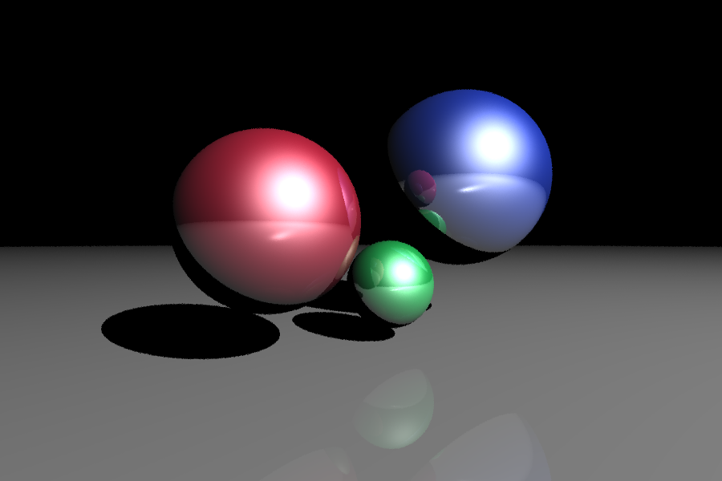

# comp_grafica_ufrj
Esse repositório  desenvolvidos para a disciplina EEL882 - Computação Gráfica

Este projeto implementa um ray tracer básico utilizado como trabalho para a disciplina EEL882 - Computação Gráfica do curso de Engenharia de Computação e Informação da Universidade Federal do Rio de Janeiro (UFRJ). Esse projeto faz uso da linguagem Python juntamente com bibliotecas populares como NumPy e Matplotlib. Siga as instruções abaixo para configurar o ambiente, instalar as dependências necessárias e executar o código em um notebook Jupyter.

#### Pré-requisitos

- Python 3.7 ou superior
- `pip` (gerenciador de pacotes Python)

#### Passos para Configuração

1. **Clone o Repositório**

   Se você ainda não clonou o repositório, faça isso agora:
   ```sh
   git clone https://github.com/seu_usuario/seu_repositorio.git
   cd seu_repositorio
   ```

2. **Crie um Ambiente Virtual**

   Recomenda-se criar um ambiente virtual para evitar conflitos de dependências com outros projetos.
   ```sh
   python -m venv env
   ```

3. **Ative o Ambiente Virtual**

   - **No Windows**
     ```sh
     .\env\Scripts\activate
     ```
   - **No macOS/Linux**
     ```sh
     source env/bin/activate
     ```

4. **Instale as Dependências**

   Com o ambiente virtual ativado, instale as dependências necessárias.
   ```sh
   pip install numpy matplotlib jupyter
   ```

5. **Inicie o Jupyter Notebook**

   Inicie o servidor Jupyter para editar e executar o notebook.
   ```sh
   jupyter notebook
   ```

6. **Abra o Notebook**

   No navegador, abra o notebook contendo o código do ray tracer. Navegue até o diretório onde o notebook está salvo e clique no arquivo para abri-lo.

7. **Execute o Código**

   No notebook Jupyter, execute as células uma a uma para entender o funcionamento e gerar a imagem renderizada.

#### Estrutura do Código

- **Célula 1**: Importação das bibliotecas necessárias.
- **Célula 2**: Definição de funções auxiliares para normalização de vetores, cálculo de reflexão e interseção de raios com esferas.
- **Célula 3**: Configuração inicial da cena, incluindo a câmera, iluminação e objetos.
- **Célula 4**: Função principal `render_scene` que realiza a renderização da cena.
- **Célula 5**: Salvamento da imagem renderizada em um arquivo PNG.

#### Salvando a Imagem

A última célula do notebook salva a imagem renderizada em um arquivo PNG chamado `ray_traced_image.png`.

Abaixo está a imagem renderizada pelo ray tracer:



#### Encerrando o Ambiente Virtual

Após terminar o trabalho no projeto, você pode desativar o ambiente virtual:
```sh
deactivate
```

---

Seguindo essas instruções, você deve conseguir configurar o ambiente e executar o código do ray tracer com sucesso. Se encontrar algum problema ou tiver dúvidas, sinta-se à vontade para abrir uma issue no repositório ou contatar o mantenedor do projeto.